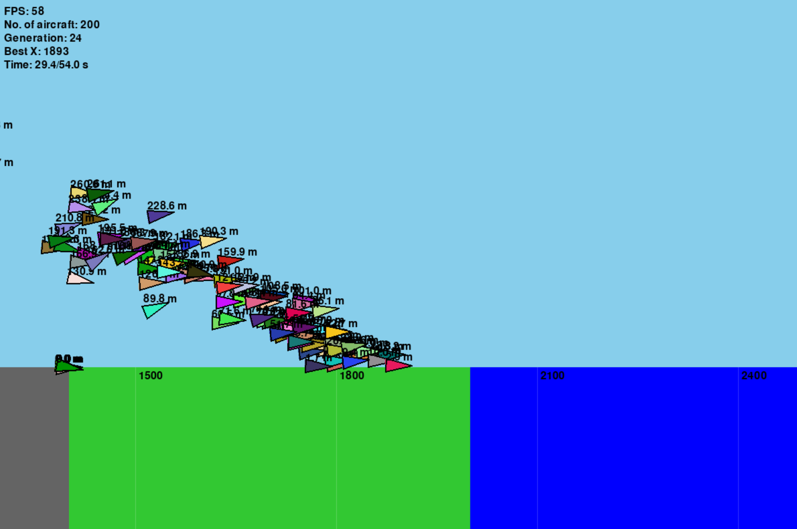

# Bio-Inspired Intelligence assignment
Genetic algorithm to train a neural controller to fly a simplified aircraft from one runway to another.



## Install
Install the required packages:
```
pip install -r requirements.txt
```

The only two dependencies are:
 - NumPy
 - PyGame

## Run code
Run the genetic algorithm code (with visualization):
```
python main.py
```
